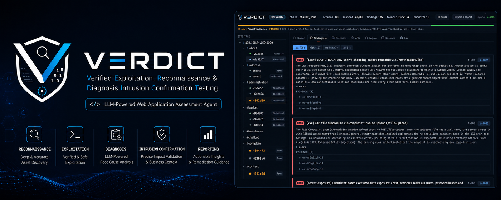

<p align="center"></p>

<h1 align="center">VERDICT</h1>

<p align="center"><b>An autonomous, evidence-disciplined web / API pentest agent.</b><br>
You give it one URL. It runs the whole assessment — recon → methodology → diagnosis → evidence → report — unattended, and <b>proves every finding.</b></p>

<p align="center">


</p>

> **This repository is the reproducible evidence — the benchmark reports and analysis.**
> The agent's source code is not public at this time; what's here is every finding's recorded proof.

---

## See it in action — sample UI

The actual **observer UI** from a real run (against **OWASP Juice Shop**), exported to a single self-contained page — site tree · findings · APIs · per-screen evidence, fully interactive and **offline**:

#### ▶ [Open the sample UI](https://vvts-alpha.github.io/verdict-pub/sample-ui.html) 
<sub>Served via GitHub Pages. It's a ~14 MB single file (screenshots + evidence bundled inline) — give it a second to load.</sub>

#### ▶ Demonstration (Youtube Movie)
[](https://youtu.be/3QHlHdktLdE?si=oZWi5gPmnPgqDURR)

The amount of tokens displayed is incorrect (it's actually about 1/10 of that).

---

## What VERDICT is

A single URL in; a finished, evidence-backed assessment out — no seed endpoint list, no test plan, no human in the loop. It maps an unknown app, decides what to test, logs in and scans behind auth, and writes a report where **every finding ships the exact request/response that proves it.**

It is neither a classic scanner (noisy, no business logic, needs config) nor a raw LLM agent (autonomous but hallucinating). It **recons like an agent and evidences like an analyst.**

## What `confirmed` means

Not "the model thinks so." A finding is marked **`confirmed`** only when a **negative control fails** *and* **≥2 positive replays succeed** — otherwise it is auto-**refuted**. Short of proof, it files a *lead*, never a fabrication. Here is the actual evidence recorded for the critical SQLi on the Juice Shop run (finding #1 of 38):

```
✗  negative control   {"email":"nonexistent@juice-sh.op","password":"wrong"}
                      →  401  "Invalid email or password"
✓  positive replay 1  {"email":"' OR 1=1--","password":"x"}
                      →  200  authenticated session as admin
✓  positive replay 2  same payload → 200, admin — stable, reproduced
```

## Benchmarks — two axes

VERDICT is measured on two different skills. Full cross-benchmark write-up: **[benchmarks/](benchmarks/)**.

### ① Detection accuracy — *can it find the vuln, even through a defense?*

- **[XBOW-Bench (XBEN-24)](benchmarks/xbow-bench) — 92% pwn (100/109)** across the 104-benchmark suite; **unaided — without the benchmark's own description — 91/91 = 100%**. Breadth × hit-rate across the class spectrum: IDOR/BOLA, SQLi (incl. blind), XSS with filter-bypass, SSTI, CMDi, LFI, XXE, SSRF, deserialization, JWT, business-logic.
- **[PortSwigger Web Security Academy](benchmarks/web-security-academy) — 16/20 detected** on the two hardest tiers (Expert ×10 + Practitioner ×10) — **12 confirmed + 4 leads** — through each lab's signature defense (a strict cache-ability check, an AngularJS sandbox **and** CSP, an HMAC-signed cookie, OOB-only blind XXE). Scored on **detection, not the lab's "solved" flag.**

### ② Autonomous exploration — *from one URL, how much of an unknown app does it find?*

- **[OWASP Juice Shop](benchmarks/juice-shop) — 38 confirmed findings across 16 vulnerability classes** in a single unattended run — from a **critical SQLi auth-bypass to admin** down to business-logic fraud (negative-quantity checkout, self-credit wallet), plus 5 suspected CVE leads. Nobody told it where to look.

Every benchmark folder ships the full per-run reports with the raw request/response evidence embedded — nothing here rests on a screenshot or a claim.

## A note on the source

The agent itself — the autonomous exploration loop, the evidence engine, the tooling — is kept private for now. These benchmarks are published as the **reproducible proof of what it can do.** Findings against live bug-bounty targets exist but are withheld under coordinated disclosure.

