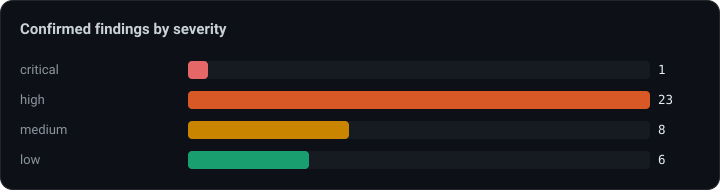
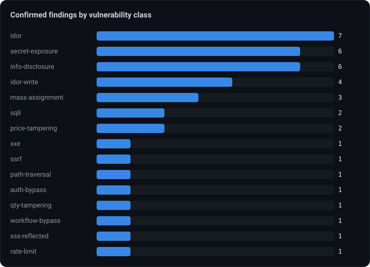

# VERDICT × OWASP Juice Shop

Latest desktop evaluation: [September 2026 review, reports, and model cost](desktop-2026-09.md).

**One autonomous VERDICT assessment of [OWASP Juice Shop](https://owasp.org/www-project-juice-shop/)** — the reference "most modern and sophisticated insecure web application." Every finding below is backed by the agent's recorded request/response evidence (see `report.html`).

   

> **38 confirmed findings** across **16 vulnerability classes** in a single unattended run — from a **critical SQL-injection auth-bypass to admin** down to business-logic fraud (negative-quantity checkout, self-credit wallet top-up) — plus **5 suspected** version-based CVE leads. Confirmed = a failing negative control + ≥2 stable positive replays; nothing is a string-match guess.

## Result at a glance

| | |
|---|---|
| Target | OWASP Juice Shop (`http://target.local:3000/`) |
| **Confirmed findings** | **38** (1 critical · 23 high · 8 medium · 6 low) |
| Suspected (needs manual verification) | 5 (version-based CVE leads) |
| Distinct vuln classes | 16 |

## Confirmed findings by severity

## Confirmed findings by vulnerability class

The spread shows breadth *and* depth: broken access control dominates (IDOR / BOLA / mass-assignment / function-level authz), alongside injection (SQLi), server-side attacks (XXE, SSRF, path-traversal), business-logic abuse, and sensitive-data exposure.

## Highlights

- 🔴 **Critical — SQLi auth-bypass to admin.** SQL injection in the login email field yields full authentication bypass as the admin user.
- 🔓 **Broken access control, everywhere.** BOLA on `/rest/basket/{id}`, `/rest/track-order/{id}`, `/api/Users/{id}`; a full user-directory dump (incl. deluxe tokens); IDOR-writes that let any user delete feedback, tamper products, and hijack another user's delivery address.
- 🗄 **Sensitive-data exposure.** `/rest/memories` leaks every user's password hash + deluxe token unauthenticated; a **BIP39 crypto-wallet seed phrase** sits in public `/api/Feedbacks`.
- 🧩 **Business-logic fraud.** Negative-quantity basket item → negative order total that checkout *accepts*; unvalidated wallet top-up = arbitrary self-credit; deluxe-membership payment bypass.
- 🧨 **Server-side.** XXE file disclosure via the complaint-invoice upload; SSRF with response readback via the profile-image URL; path traversal through **poison null-byte** filter bypass leaking source/config.
- 🧪 **Suspected (5).** Version-based CVE leads from a leaked `package-lock.json.bak` — express-jwt CVE-2020-15084 (JWT authz bypass), marsdb RCE, js-yaml RCE, libxmljs XXE — surfaced honestly for manual confirmation, not counted as confirmed.

## All findings

<b>38 confirmed + 5 suspected</b>

**Confirmed**

| # | Severity | Class | Finding |
|---|---|---|---|
| 1 | critical | sqli | SQL injection in login email field yields full authentication bypass as admin |
| 2 | high | idor | IDOR / BOLA: any user's shopping basket readable via /rest/basket/{id} |
| 3 | high | xxe | XXE file disclosure via complaint invoice upload (/file-upload) |
| 4 | high | secret-exposure | Unauthenticated excessive data exposure: /rest/memories leaks all users' password hashes and deluxeTokens |
| 5 | high | price-tampering | Deluxe membership payment bypass via paymentMode tampering (deluxe fraud) |
| 6 | high | ssrf | Server-Side Request Forgery via profile image URL with response readback |
| 7 | high | path-traversal | Path traversal via null-byte poisoning bypasses /ftp file-type filter (source/config disclosure) |
| 8 | high | sqli | SQL injection in product search q parameter |
| 9 | high | auth-bypass | Unauthenticated read of accountant-restricted inventory collection (GET /api/Quantitys) |
| 10 | high | mass-assignment | Mass-assignment on POST /api/Complaints: client-controlled UserId lets a user forge complaint ownership |
| 11 | high | idor | Broken access control: /rest/user/authentication-details leaks all users' account records to any authenticated |
| 12 | high | idor | IDOR: any authenticated customer can read arbitrary user records via GET /api/Users/{id} |
| 13 | high | idor | Broken function-level authorization: customer can dump the entire user directory (incl. deluxe tokens) via GET |
| 14 | high | mass-assignment | Mass-assignment of UserId on POST /api/Feedbacks (Forged Feedback) |
| 15 | high | idor-write | Any authenticated user can delete arbitrary feedback (DELETE /api/Feedbacks/{id}) |
| 16 | high | idor-write | Unauthenticated product tampering — no access control on PUT /api/Products/{id} |
| 17 | high | idor-write | IDOR: any user can modify & hijack another user's delivery address via PUT /api/Addresss/{id} |
| 18 | high | qty-tampering | Negative quantity accepted on basket item enables negative order total (financial manipulation) |
| 19 | high | price-tampering | Unvalidated wallet top-up allows arbitrary/negative self-credit (free store credit) |
| 20 | high | idor-write | Unauthenticated cross-user account takeover via Forgot-Password security-question reset |
| 21 | high | idor | BOLA: /rest/track-order/{id} returns any order's details with no authentication or ownership check |
| 22 | high | secret-exposure | Crypto wallet seed phrase (BIP39 mnemonic) exposed in public /api/Feedbacks |
| 23 | high | mass-assignment | Privilege escalation via mass-assignment of "role" on user registration |
| 24 | high | workflow-bypass | Checkout completes an order with a negative total from a negative-quantity basket item |
| 25 | medium | xss-reflected | DOM-based XSS in product search (#/search?q=) |
| 26 | medium | secret-exposure | Forgotten coupon backup file exposed via poison null-byte bypass (/ftp/coupons_2013.md.bak) |
| 27 | medium | secret-exposure | Sensitive developer artifact exposed: encrypt.pyc (compiled encryption module) downloadable via null-byte filt |
| 28 | medium | secret-exposure | Forgotten backup file /ftp/package.json.bak retrievable via Poison Null Byte, leaking dependency manifest |
| 29 | medium | secret-exposure | Sensitive backup file (package-lock.json.bak) exposed via Poison Null Byte bypass |
| 30 | medium | idor | Broken object-level authorization: any authenticated user reads all users' complaints |
| 31 | medium | info-disclosure | Excessive data exposure: /rest/user/whoami fields param leaks password hash & TOTP secret |
| 32 | medium | idor | BOLA: GET /api/BasketItems lists all users' basket items |
| 33 | low | rate-limit | CAPTCHA never invalidated — solved captcha reusable for unlimited feedback submissions |
| 34 | low | info-disclosure | Prometheus /metrics endpoint exposed without authentication |
| 35 | low | info-disclosure | robots.txt discloses /ftp, which has directory listing enabled exposing sensitive files |
| 36 | low | info-disclosure | Confidential acquisitions document accessible without authentication (/ftp/acquisitions.md) |
| 37 | low | info-disclosure | Verbose 500 error leaks stack trace, internal paths and framework version on memory upload |
| 38 | low | info-disclosure | Verbose error/stack-trace disclosure on memory upload (invalid mime type) |

**Suspected** (needs manual verification)

| # | Severity | Class | Finding |
|---|---|---|---|
| 1 | high | vulnerable-component | High/critical-severity vulnerable dependencies disclosed by leaked package-lock.json.bak |
| 2 | high | vulnerable-component | Outdated express-jwt 0.1.3 — CVE-2020-15084 JWT authorization bypass |
| 3 | high | vulnerable-component | Outdated marsdb 0.6.x — command injection / arbitrary code execution |
| 4 | high | vulnerable-component | Outdated js-yaml 3.10 — arbitrary code execution via load() (< 3.13.1) |
| 5 | high | vulnerable-component | Outdated libxmljs 0.18 — XML External Entity (XXE) injection |

## Methodology

- **Evidence discipline** — a finding is `confirmed` only with a **negative control that fails + ≥2 positive replays that succeed**; catch-all 200s / unstable responses are auto-refuted. Every finding in `report.html` embeds the proving requests and responses.
- **Suspected tier** — version-based CVE leads (from a leaked lockfile) are surfaced as *suspected* — real leads for a human to confirm, deliberately kept out of the confirmed count.
- **Reproduce** — regenerated from the agent's own recorded run artifacts (build tooling is part of the private source).

## Files

- `README.md` — this analysis.
- `report.html` / `report.md` — the full VERDICT report, **with request/response evidence** for every finding.
- `assets/*.svg` — the charts above.
