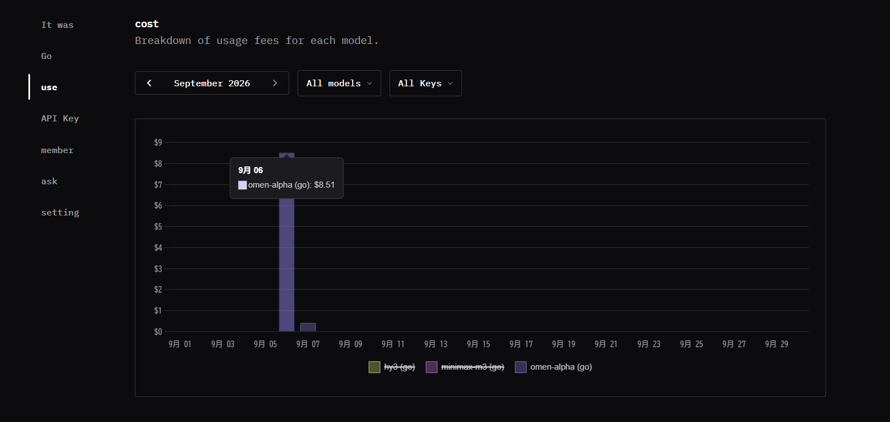

# Desktop assessment review — September 2026

A desktop assessment of local OWASP Juice Shop 20.2.0 reached the report phase with 154 mapped screens marked scanned and none remaining. The run used three configured accounts: one administrator and two customers.

| Item | Recorded value |
| --- | --- |
| Assessment | `a-mtoiju1k-ajc469` |
| Started | 2026-09-05 15:04 UTC |
| Original report generated | 2026-09-06 23:54 UTC |
| Provider / model | OpenCodeGo / `omen-alpha` (operator reported) |
| Actual charge | **US$9.92** (operator reported; not a token-price estimate) |
| Original report | 59 confirmed-category entries, 6 medium-or-higher suspected leads, 1 low-signal note |

The start-to-export interval includes any pauses or time before export; it is not measured active scan time. This single run does not establish the model's general accuracy or expected cost on other targets. The original 59 entries are not 59 independently validated, unique vulnerabilities.

## Public sample report

[Markdown](desktop-2026-09/report.md) · [PDF](desktop-2026-09/report.pdf) · [HTML](desktop-2026-09/report.html)

These exports use VERDICT's report renderers and retain the reviewed finding narratives and reproduction steps. Publication edits redact credentials and account data; raw HTTP bodies and private artifacts are omitted. Evidence IDs remain as references to the private run. Automated wording can still contain false positives, overlaps, or overstated impact; redaction is not independent security validation. HTML/PDF group all six unconfirmed entries together; Markdown separates five medium-or-higher leads from one low-signal note.

## Model usage and cost

The operator supplied the following OpenCodeGo usage screenshot. Its September 6 tooltip shows **`omen-alpha (go): US$8.51`**. The view has **All models / All Keys** selected and displays daily charges; it does not show a token count or isolate this assessment. The earlier **US$9.92** figure remains the operator-reported assessment total. The screenshot alone cannot reconcile the difference.

## Evidence worth demonstrating

- Login SQL injection: a false condition receives 401; two true-condition replays receive an administrator session.
- DOM XSS: the benign control does not execute; two browser probes record execution in the search route.
- Address ownership: one user can update another user's address and the record subsequently appears in the attacker's address list.

## Review corrections

The original output repeats login SQLi, DOM XSS, unsigned JWT acceptance, and address-write findings across screens. Password-digest exposure also appears at different confidence levels. Final review now consolidates supported duplicate cases while retaining original records and evidence.

Applying the deterministic corrections to the saved evidence consolidates six duplicate entries (four confirmed and two suspected). One confirmed XSS entry moves to suspected, and the wallet finding moves from high to medium. The resulting report has **54 confirmed-category entries, five medium-or-higher suspected leads, and one low-signal note**. These are revised report counts, not an independent validation of every remaining entry; no model review was rerun for this correction.

An upload's acceptance is not proof of browser script execution. That XSS claim remains a lead until execution is demonstrated. Negative wallet deposits establish an amount-validation flaw; deposit responses alone do not establish theft or an external payout.

Review runs against a database copy and existing artifacts, without another target scan or model request. The original report and live assessment remain unchanged. The public sample above omits raw artifacts; the private originals remain unchanged.
